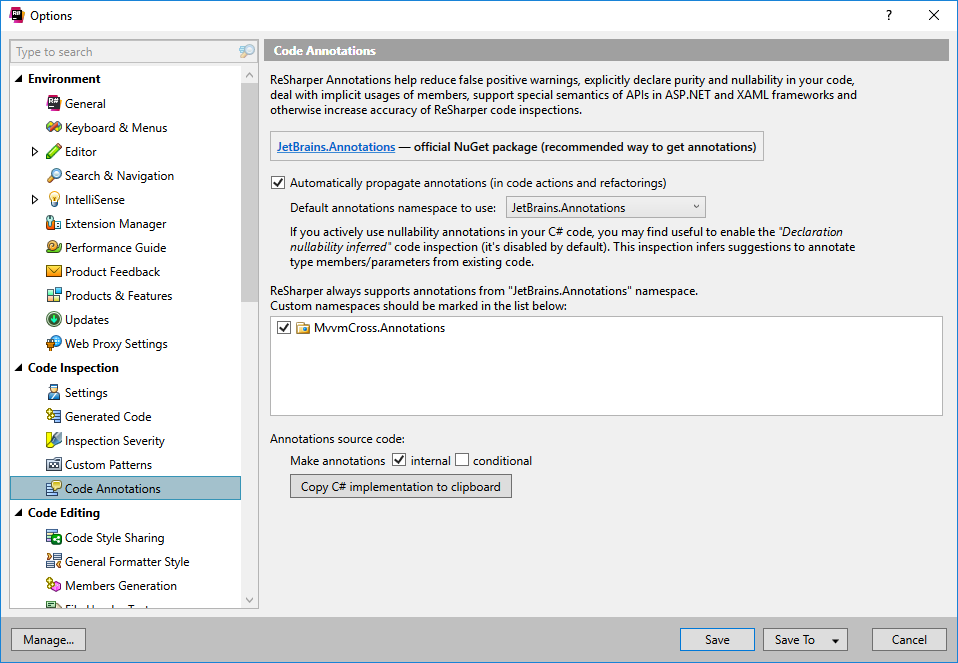

MvvmCross contains code annotation, compatible with ReSharper. For your ReSharper installation to understand these, you have to enable the MvvmCross namespace.

Open the ReSharper options window, by navigating through the menu. Go to ReSharper | Options. Then select the `Code Annotations` item in the `Code Inspection` category.
You should see a listbox with an entry named `MvvmCross.Annotations`. Checking the item and saving the options makes resharper recognize the MvvmCross annotations.

