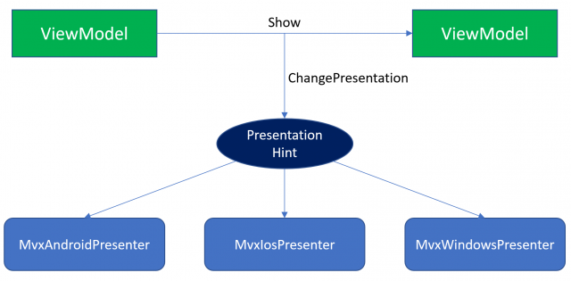

View Presenters are a key object in the MvvmCross architecture. It is a singleton that acts as a glue between your Views and your ViewModels. As the name implies, a view presenter takes a ViewModel presentation request (that is built once you call `ShowViewModel<MyViewModel>()`) and decides how it will be presented on the UI.

By using View Presenters, MvvmCross provides a clear separation between the ViewModel and the View layer. This gives a cross platform app a lot of power, since each platform can make real use of all of its capabilities.

Going further with the previous idea, it is important to notice that each platform has its own and unique navigation and presentation patterns, and this is why a presenter deals directly with the View layer. To help illustrate the idea, let's consider this example:

- On Android, an App could include a content area and side menu - NavigationDrawer -. Most of the options are available through the side menu or a toolbar.
- On iOS, the same app could include bottom tabs, where each tab can contain its own navigation stack.
- On MacOS, once again the same app could include a window with a split view.
- ...

MvvmCross provides default presenters for each platform that support the most used patterns and strategies. However, sometimes you might find yourself needing to display a ViewModel in a particular or rare way that is not covered. This means, you will need to create a custom presenter by subclassing one of the provided by MvvmCross or by implementing the interface [IMvxViewPresenter](https://github.com/MvvmCross/MvvmCross/blob/89eb738f36e600f6e9aa1555e2b4bb6484c553cb/MvvmCross/Core/Core/Views/IMvxViewPresenter.cs).

Let's take a look now at the methods of that interface:

- `Show(MvxViewModelRequest request)`: This method is in charge of deciding how a view should be presented and then show it. It takes a ViewModel request as parameter, which contains all the the information passed in `ShowViewModel`.
- `AddPresentationHintHandler<THint>(Func<THint, bool> action) where THint : MvxPresentationHint`: You can use this method to register your custom PresentationHints and their respective handlers (we will explore the PresentationHint concept a bit later).
- `ChangePresentation(MvxPresentationHint hint)`: This method is the one that gets called whenever a PresentationHint is requested. It is responsible for handling the requested change.
- `Close(IMvxViewModel toClose)`: As you can imagine, this method is used to handle the close request of a ViewModel. It takes the ViewModel instance to be closed as parameter.

## View Presenters on each platform
Each platform has its own View Presenter:
- Android: [MvxAndroidViewPresenter](https://github.com/MvvmCross/MvvmCross/blob/develop/MvvmCross/Droid/Droid/Views/MvxAndroidViewPresenter.cs) - [Documentation](https://www.mvvmcross.com/documentation/presenters/android-view-presenter)
- Android (support packages): [MvxAppCompatViewPresenter](https://github.com/MvvmCross/MvvmCross/blob/develop/MvvmCross-AndroidSupport/MvvmCross.Droid.Support.V7.AppCompat/MvxAppCompatViewPresenter.cs) - [Documentation](https://www.mvvmcross.com/documentation/presenters/android-view-presenter)
- iOS: [MvxIosViewPresenter](https://github.com/MvvmCross/MvvmCross/blob/develop/MvvmCross/iOS/iOS/Views/Presenters/MvxIosViewPresenter.cs) - [Documentation](https://www.mvvmcross.com/documentation/presenters/ios-view-presenter)
- UWP: [MvxWindowsViewPresenter](https://github.com/MvvmCross/MvvmCross/blob/develop/MvvmCross/Windows/Uwp/Views/MvxWindowsViewPresenter.cs)
- WPF: [MvxWpfViewPresenter](https://github.com/MvvmCross/MvvmCross/blob/develop/MvvmCross/Windows/Wpf/Views/Presenters/MvxWpfViewPresenter.cs) - [Documentation](https://www.mvvmcross.com/documentation/presenters/wpf-view-presenter)
- macOS: [MvxMacViewPresenter](https://github.com/MvvmCross/MvvmCross/blob/develop/MvvmCross/Mac/Mac/Views/Presenters/MvxMacViewPresenter.cs) - [Documentation](https://www.mvvmcross.com/documentation/presenters/mac-view-presenter)
- tvOS: [MvxTvosViewPresenter](https://github.com/MvvmCross/MvvmCross/blob/develop/MvvmCross/tvOS/tvOS/Views/Presenters/MvxTvosViewPresenter.cs) - [Documentation](https://www.mvvmcross.com/documentation/presenters/tvos-view-presenter)

When you navigate to selected ViewModel, platform specific View Presenter handles displaying View properly.

 

MvvmCross ViewPresenters will provide you with a set of attributes on each platform. For example on iOS, [these](https://github.com/MvvmCross/MvvmCross/tree/develop/MvvmCross/iOS/iOS/Views/Presenters/Attributes) are the existing ones: 

- MvxTabPresentationAttribute – for tabs
- MvxRootPresentationAttribute – to set a ViewController as root
- MvxModalPresentationAttribute – to display a ViewController modally
- MvxMasterSplitViewPresentationAttribute – for SplitView master controller
- MvxDetailSplitViewPresentationAttribute – for SplitView details controller

This is how you would use these attributes:

 ```c#
    [MvxModalPresentation]
    public class DetailsViewController : ApplicationBaseMvxViewController<DetailsViewModel>
    {
        // your code 
    }
```

## Showing ViewModels
The most important method of a ViewPresenter is `Show`. It is in charge of transforming a request coming from the _Core_ project into a View the user can interact with.
There are several techniques to implement this method, but the preferred way by the MvvmCross default presenters is to use custom class attributes. These let the presenter know how a View wants to be presented on the UI. For instance, on iOS you would typically declare a ViewController like this:

```c#
namespace Playground.iOS.Views
{
    [MvxRootPresentation(WrapInNavigationController = true)]
    public partial class MyView : MvxViewController<MyViewModel>
    {
        // your UI code
    }
}
```

In this example the attribute is telling the Presenter that whenever a ViewModel request for `MyViewModel` arrives, it should display the View as a root and wrap it into a NavigationController (it initiates a navigation stack).

## Requesting presentation changes
Although for most apps showing / closing ViewModels is enough, there is one more tool that MvvmCross offers, and it is extremely powerful: the ability to request a change to the UI layer.

The best example we can give about this is the `Close` method itself. Once you call Close from a ViewModel or a MvxNavigatingObject, what MvvmCross internally do is to send a `MvxClosePresentationHint` to the ViewPresenter, which then calls `Close(IMvxViewModel toClose)`. You can see how this happen in the [iOS Presenter](https://github.com/MvvmCross/MvvmCross/blob/b4ca1f492b996c9a836f494b7873033336ea83de/MvvmCross/iOS/iOS/Views/Presenters/MvxIosViewPresenter.cs#L67).

It is important to remark here that these are just unbound requests. Each platform is then responsible for deciding how a presentation hint should be handled - you can also decide to just ignore a hint type -.

To add your own `MvxPresentationHint` you should follow these steps:

1. Create a MvxPresentationHint subclass:

    ```c#
    public class MyCustomHint : MvxPresentationHint
    {
        public string ImportantInformation { get; set; }

        public MyCustomHint(string importantInformation)
        {
            ImportantInformation = importantInformation;
        }
    }
    ```

2. Override the method `CreatePresenter()` in the Setup class and register your custom hint in it. For example, on iOS:
    ```c#
    protected override IMvxIosViewPresenter CreatePresenter()
    {
        var presenter = base.CreatePresenter();
        presenter.AddPresentationHintHandler<MyCustomHint>(hint => HandleMyCustomHint(hint));
        return presenter;
    }
    ```

3. Implement `HandleMyCustomHint` method, which will return true if the presentation change was successfully handled or false otherwise:
    ```c#
    private bool HandleMyCustomHint(MyCustomHint hint)
    {
        bool result;

        if(hint.ImportantInformation != null)
        // your code

        return result;
    }
    ```
    **Now repeat steps 2 and 3 for each platform (if a platform should just ignore the MvxPresentationHint, it's not necessary to do anything).**

4. Finally, make a call to the ChangePresentation method from a MvxViewModel or a MvxNavigatingObject when necessary:
    ```c#
    private void AMethod()
    {
        // your code

        ChangePresentation(new MyCustomHint("example"));

        // your code
    }
    ```

Ready!


Another kind of presentation changes your app can request through hints includes clearing / modifying the BackStack, changing a root while maintaining the existent views, ... possibilities are really endless. Once again your app is king here!
