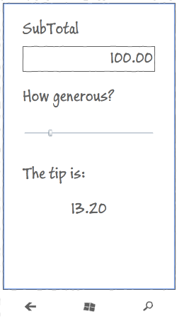
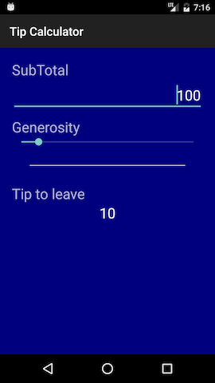

We started with the goal of creating an app to help calculate what tip to leave in a restaurant

We had a plan to produce a UI based on this concept:



To satisfy this we built a 'Core' Portable Class Library project which contained:

* our 'business logic' - `ICalculation`
* our ViewModel - `TipViewModel`
* our `App` which contains the application wiring, including the start instructions.

We then added User Interfaces for Xamarin.Android and Xamarin.iOS

 

For our next project, let's look at Windows, specifically Universal Windows Platform (UWP) Apps which run on Windows 10 and Windows 10 Mobile.

To create a Windows UWP MvvmCross UI, you can use the Visual Studio project template wizards, but here we'll instead build up a new project 'from empty', just as we did for the Core and other UI projects.

## Create a new Windows UWP Project

Add a new project to your solution - a 'Blank App (Universal Windows)' application with name `TipCalc.UI.UWP`

Within this, you'll find the normal WindowsStore application constructs:

* the 'Properties' folder with just the 'AssemblyInfo' file
* the 'Assets' folder
* the 'Common' folder
* the App.Xaml 'application' object
* the MainPage.Xaml and MainPage.Xaml.cs files that define the default Page for this app
* the 'Package.appxmanifest' configuration file
* the 'project.json'
* the debug private key for your development

## Delete MainPage.xaml

No-one really needs a `MainPage` :)

## Install MvvmCross

In the Package Manager Console, enter...

    Install-Package MvvmCross.Core

## Add a reference to TipCalc.Core.csproj

Add a reference to your `TipCalc.Core` project - the project we created in the last step which included:

* your `Calculation` service, 
* your `TipViewModel` 
* your `App` wiring.

## Add a Setup class

Just as we said during the Android, iOS and WO construction *Every MvvmCross UI project requires a `Setup` class*

This class sits in the root namespace (folder) of our UI project and performs the initialization of the MvvmCross framework and your application, including:

  * the Inversion of Control (IoC) system
  * the MvvmCross data-binding
  * your `App` and its collection of `ViewModel`s
  * your UI project and its collection of `View`s

Most of this functionality is provided for you automatically. Within your Windows UWP UI project all you have to supply is:

- your `App` - your link to the business logic and `ViewModel` content.

For `TipCalc` here's all that is needed in Setup.cs:

```c#
using Windows.UI.Xaml.Controls;
using MvvmCross.Core.ViewModels;
using MvvmCross.WindowsUWP.Platform;

namespace TipCalc.UI.UWP
{
public class Setup : MvxWindowsSetup
{
    public Setup(Frame rootFrame) : base(rootFrame)
    {
    }

    protected override IMvxApplication CreateApp()
    {
        return new Core.App();
    }
}
}
```

## Modify the App.xaml.cs to use Setup

Your `App.xaml.cs` provides the Windows UWP 'main application' object - an object which owns the User Interface and receives some callbacks from the operating system during some key events in your application's lifecycle.

To modify this `App.xaml.cs` for MvvmCross, we need to:

* modify the `OnLaunched` callback

 * replace this lines

```c#
// When the navigation stack isn't restored navigate to the first page,
// configuring the new page by passing required information as a navigation
// parameter
rootFrame.Navigate(typeof(MainPage), e.Arguments);
```

  * with these lines to allow it to create `Setup`, and to then initiate the `IMvxAppStart` `Start` navigation

```c#
var setup = new Setup(rootFrame);
setup.Initialize();

var start = Mvx.Resolve<IMvxAppStart>();
start.Start();
```

After you've done this your code might look like:

```c#
using System;
using System.Collections.Generic;
using System.IO;
using System.Linq;
using System.Runtime.InteropServices.WindowsRuntime;
using Windows.ApplicationModel;
using Windows.ApplicationModel.Activation;
using Windows.Foundation;
using Windows.Foundation.Collections;
using Windows.UI.Xaml;
using Windows.UI.Xaml.Controls;
using Windows.UI.Xaml.Controls.Primitives;
using Windows.UI.Xaml.Data;
using Windows.UI.Xaml.Input;
using Windows.UI.Xaml.Media;
using Windows.UI.Xaml.Navigation;
using MvvmCross.Core.ViewModels;
using MvvmCross.Platform;

namespace TipCalc.UI.UWP
{
/// <summary>
/// Provides application-specific behavior to supplement the default Application class.
/// </summary>
sealed partial class App : Application
{
    /// <summary>
    /// Initializes the singleton application object.  This is the first line of authored code
    /// executed, and as such is the logical equivalent of main() or WinMain().
    /// </summary>
    public App()
    {
        Microsoft.ApplicationInsights.WindowsAppInitializer.InitializeAsync(
            Microsoft.ApplicationInsights.WindowsCollectors.Metadata |
            Microsoft.ApplicationInsights.WindowsCollectors.Session);
        this.InitializeComponent();
        this.Suspending += OnSuspending;
    }

    /// <summary>
    /// Invoked when the application is launched normally by the end user.  Other entry points
    /// will be used such as when the application is launched to open a specific file.
    /// </summary>
    /// <param name="e">Details about the launch request and process.</param>
    protected override void OnLaunched(LaunchActivatedEventArgs e)
    {

#if DEBUG
        if (System.Diagnostics.Debugger.IsAttached)
        {
            this.DebugSettings.EnableFrameRateCounter = true;
        }
#endif

        Frame rootFrame = Window.Current.Content as Frame;

        // Do not repeat app initialization when the Window already has content,
        // just ensure that the window is active
        if (rootFrame == null)
        {
            // Create a Frame to act as the navigation context and navigate to the first page
            rootFrame = new Frame();

            rootFrame.NavigationFailed += OnNavigationFailed;

            if (e.PreviousExecutionState == ApplicationExecutionState.Terminated)
            {
                //TODO: Load state from previously suspended application
            }

            // Place the frame in the current Window
            Window.Current.Content = rootFrame;
        }

        if (rootFrame.Content == null)
        {
            //// When the navigation stack isn't restored navigate to the first page,
            //// configuring the new page by passing required information as a navigation
            //// parameter
            //rootFrame.Navigate(typeof(MainPage), e.Arguments);
            var setup = new Setup(rootFrame);
            setup.Initialize();

            var start = Mvx.Resolve<IMvxAppStart>();
            start.Start();
        }
        // Ensure the current window is active
        Window.Current.Activate();
    }

    /// <summary>
    /// Invoked when Navigation to a certain page fails
    /// </summary>
    /// <param name="sender">The Frame which failed navigation</param>
    /// <param name="e">Details about the navigation failure</param>
    void OnNavigationFailed(object sender, NavigationFailedEventArgs e)
    {
        throw new Exception("Failed to load Page " + e.SourcePageType.FullName);
    }

    /// <summary>
    /// Invoked when application execution is being suspended.  Application state is saved
    /// without knowing whether the application will be terminated or resumed with the contents
    /// of memory still intact.
    /// </summary>
    /// <param name="sender">The source of the suspend request.</param>
    /// <param name="e">Details about the suspend request.</param>
    private void OnSuspending(object sender, SuspendingEventArgs e)
    {
        var deferral = e.SuspendingOperation.GetDeferral();
        //TODO: Save application state and stop any background activity
        deferral.Complete();
    }
}
}
```

## Add your View

### Create an initial Page

Create a Views folder

Within this folder, add a new 'Blank Page' and call it `TipView.xaml`

You will be asked if you want to add the missing 'Common' files automatically in order to support this 'Basic Page' - answer **Yes**

The page will generate:

* TipView.xaml
* TipView.xaml.cs

### Turn TipView into the MvvmCross View for TipViewModel

Change:

```public class TipView : Page```

To:

```public class TipView : MvxWindowsPage```

This requires the addition of:

```using MvvmCross.WindowsUWP.Views;```

Altogether this looks like:

```c#
using MvvmCross.WindowsUWP.Views;

// The Blank Page item template is documented at http://go.microsoft.com/fwlink/?LinkId=234238

namespace TipCalc.UI.UWP.Views
{
/// <summary>
/// An empty page that can be used on its own or navigated to within a Frame.
/// </summary>
public sealed partial class TipView : MvxWindowsPage
{
    public TipView()
    {
        this.InitializeComponent();
    }
}
}
```

### Edit the XAML layout

Double click on the XAML file

This will open the XAML editor within Visual Studio.

I won't go into much depth at all here about how to use the XAML or do the Windows data-binding. I'm assuming most readers are already coming from at least a little XAML background.

To add the XAML user interface for our tip calculator, we will add a StackPanel within the existing Grid.

* a `StackPanel` container, into which we add:
  * some `TextBlock` static text
  * a bound `TextBox` for the `SubTotal`
  * a bound `Slider` for the `Generosity`
  * a bound `TextBlock` for the `Tip`

The full page will look like:

```xml
<views:MvxWindowsPage
    x:Class="TipCalc.UI.UWP.Views.TipView"
    xmlns="http://schemas.microsoft.com/winfx/2006/xaml/presentation"
    xmlns:x="http://schemas.microsoft.com/winfx/2006/xaml"
    xmlns:local="using:TipCalc.UI.UWP.Views"
    xmlns:d="http://schemas.microsoft.com/expression/blend/2008"
    xmlns:mc="http://schemas.openxmlformats.org/markup-compatibility/2006"
    xmlns:views="using:MvvmCross.WindowsUWP.Views"
    mc:Ignorable="d">

    <Grid Background="{ThemeResource ApplicationPageBackgroundThemeBrush}">
        <StackPanel Margin="12,0,12,0">
            <TextBlock Text="SubTotal" />
            <TextBox Text="{Binding SubTotal, Mode=TwoWay, UpdateSourceTrigger=PropertyChanged}" />
            <TextBlock Text="Generosity" />
            <Slider Value="{Binding Generosity,Mode=TwoWay}" 
                SmallChange="1" 
                LargeChange="10" 
                Minimum="0" 
                Maximum="100" />
            <TextBlock Text="Tip" />
            <TextBlock Text="{Binding Tip}" />
        </StackPanel>
    </Grid>
</views:MvxWindowsPage>
```

**Note** that in XAML, `OneWay` binding is generally the default. To provide TwoWay binding we explicitly add `Mode` to our binding expressions: e.g. `Value="{Binding Generosity,Mode=TwoWay}"`

**Note** the binding for the TextBox uses `UpdateSourceTrigger=PropertyChanged` so that the `SubTotal` property of `TipViewModel` is updated immediately rather than when the TextBox loses focus.

In the designer, this will look like:


## The Store UI is complete!

At this point you should be able to run your application either on the Local Machine or in a Mobile emulator.

When it starts... you should see this for the local machine:


and in the mobile emulator:


## Moving on...

There's more we could do to make this User Interface nicer and to make the app richer... but for this first application, we will leave it here for now.

Let's move on to the next piece of Windows!

